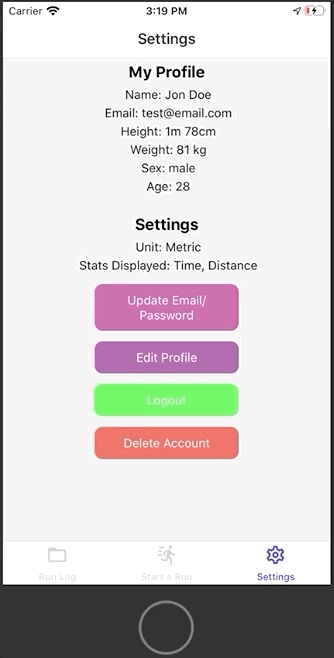
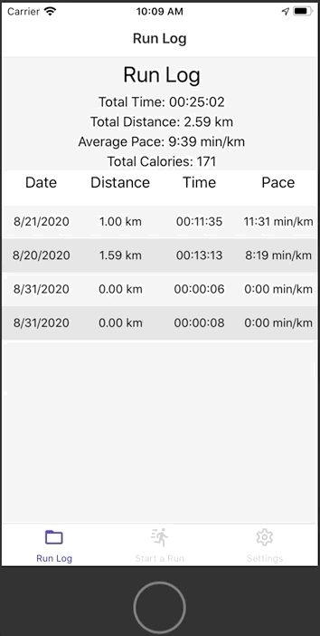
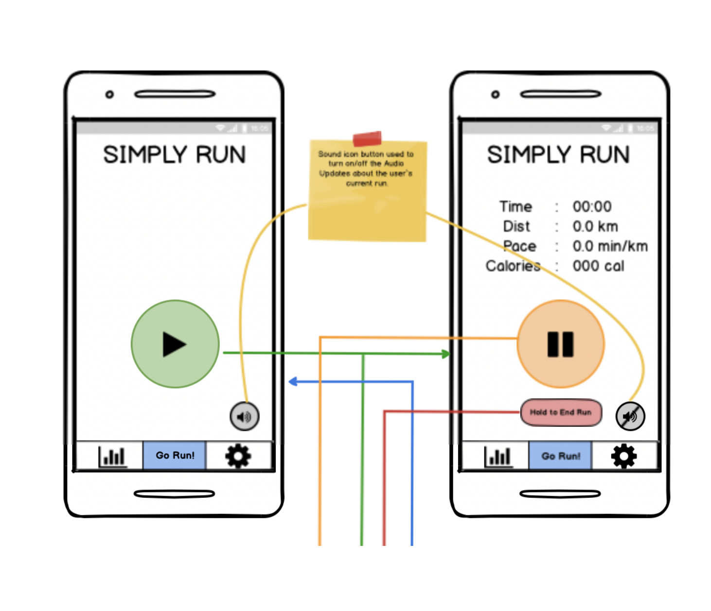
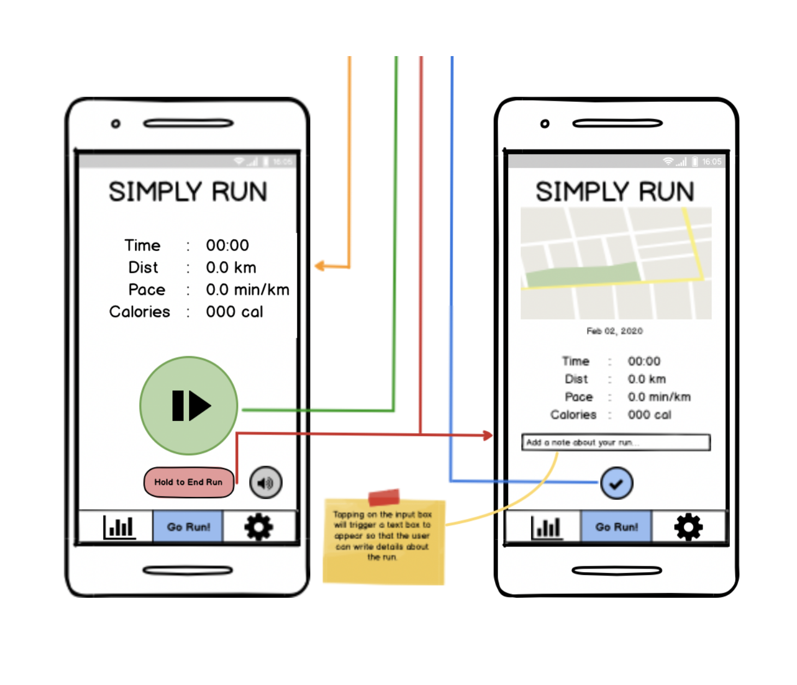
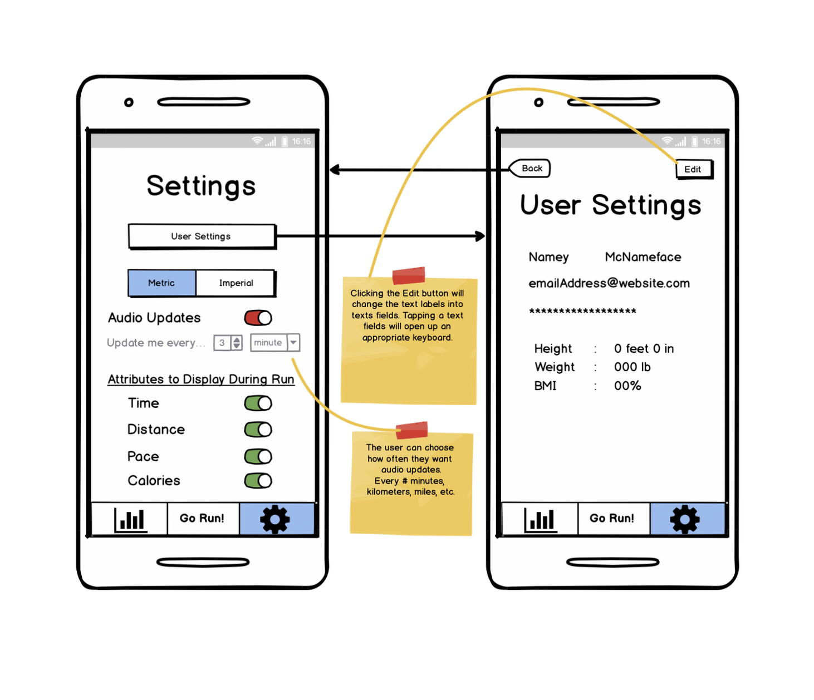
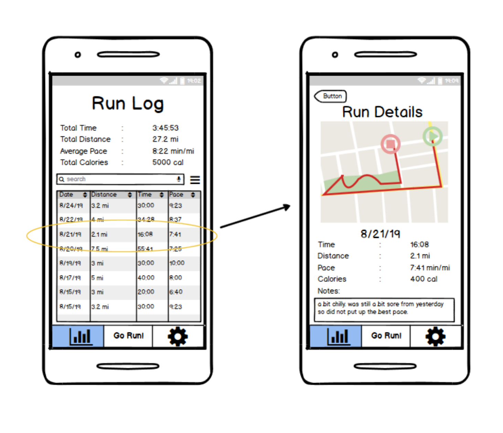
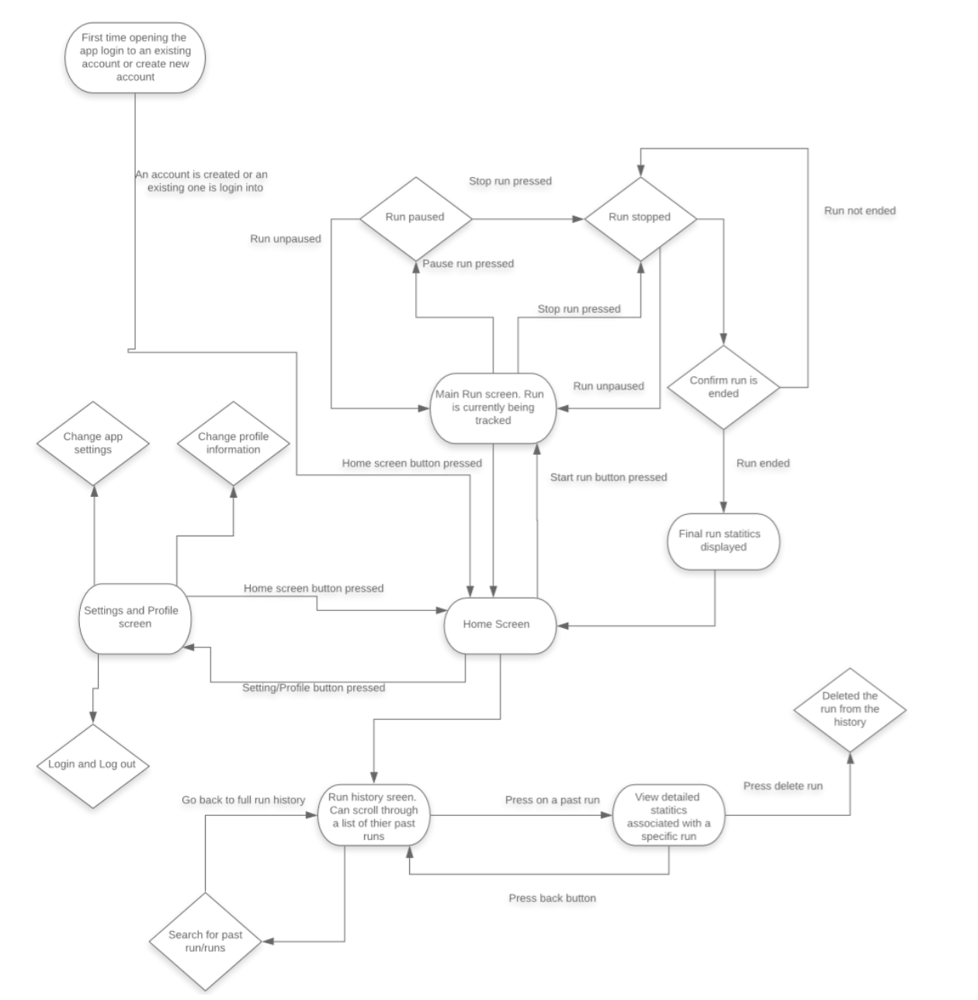
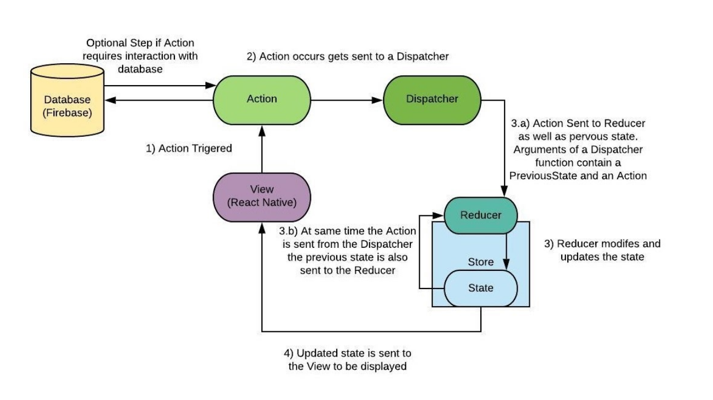

# **Simply Run**
>Team: Sam Peaslee, Ethan Gabrielse, Silas Setterstrom, Peter Newman, Shashwat Arya, Andy Waldron  
>CS506 - Software Engineering  
>Proj. Tracy Lewis-Williams  

#### Table of Contents
1. [Project Abstract](###-1.-Project-Abstract**)   
2. [Exposition](###-2.-Exposition**)
3. [Run with Expo-Client](###-**3.-Run-with-Expo-Client**)
4. [Design Details](###-4.-Design-Details**)

## **1. Project Abstract**
There are a lot of runners in this world, a quick google search tells you that in 2017 almost 60 million people participated in running events in the United States. There’s also a lot of mobile running apps. So why make a new running app? I’m an avid runner and have not found a running app that I’m completely satisfied with. Running apps have gotten unnecessarily complicated. They have become congested with excessive stats, features, and pop ups, all of which can be overwhelming to the user. They focus too much on specific training routines and sharing your workout via social media. Running is a simple activity and only requires a simple app. Simply Run would provide this, a running app that does not get lost in unnecessary features and statistics so a user can focus on what’s important, running. Our target audience is not the entire running community. There are clearly plenty of runners who enjoy the social media connectivity and more diverse set of features offered by our competitors. But there are no doubt many runners want something simple that just works.

## **2. Exposition**
### *Create Account:*

### *Edit Profile:*

### *Change Password:*

### *Login:*

### *Go for a run:*
#### Note: Emulator does not track actual location (must be run on an actual smartphone for this).

### *View Run in Run Log:*
#### These two runs depict actual data from the app running on an iPhone 8.

### *Change Ordering of Run Log:*

### *Delete Run:*

## **3. Run with Expo-Client**
#### *Pre-requisites:*
- *Expo Client* downloaded on your smartphone
- Install version 14.8.0 of *Node JS* on your computer (https://nodejs.org/en/download/)
- Install *Expo* on your computer: **npm install -g expo-cli** (*Node JS* must be installed first).
#### *Running the App:*
1. git clone https://github.com/egabrielse/SimplyRun.git
2. cd SimplyRun
3. npm install 
4. expo start
5. Scan the QR code in the terminal window to open app on smartphone
6. ctrl + c to terminate the app

## **4. Design Details**
### **User Requirements:**
1. **User opens the application for the first time.**
    - The application loads and displays a screen where the user can either create a new account or login to an existing account.  
    - For create new account, the user will input their username, password, and email, as well as their gender, height, and weight for calorie tracking.
    - The user will then be prompted to enter a confirmation code that was sent via email
    - The login screen will simply request the username and password.
2. **Stats & History Tab**
    - Displays basic stats from the user’s past runs, such as the distance, pace, and date. 
    - Allow users to click into past runs and view more detailed stats, such as calories burned and potentially others such as split pace and elevation gain.
    - Allows user to view a map of the route they ran for each run
    - Allows user to delete old runs
3. **Settings Tab**
    - Displays the user's current user info (not including password)
    - Allows the user to edit their profile (reset password, change email, edit height/weight info, etc.) and settings such as color theme, switching to metric system for distance and which features to display.
4. **Run Tab : User runs**
    - Displays a start button and map.
    - User presses the start button and the app begins tracking their run. 
    - While running, the elapsed time, distance run, and pace are displayed
    - While the user is running, the app continuously tracks their location to determine distance and pace. 
    - App uses distance and pace, as well as the user’s gender, height, and weight, to determine calories burned.
    - Button will allow users to pause their run. Pressing the pause button once brings up the option to either resume run or end it. 
    - After the user has ended their run, the app will display a summary of all the tracked stats of the run, and allows the user to choose to save or discard the run.

### **UI Mockup:**

### **Database:**
For our database, we will be using Firebase’s Cloud Firestore, which is a DBaaS (data-base as a service). Firestore is a NoSQL database that supports hierarchical data structures. Data is put into “documents” and these documents are organized into “collections.” A document itself can contain a collection (called a subcollection). Our data for a user will be organized as shown in the diagram below. The name is listed, followed by the type.

### **Data Flow:**
We will be using Redux in our application, which is a state managing JavaScript library, that uses a unidirectional data flow system architecture. The key component of this architecture is that data has only one way to be transferred from one part of the application to another. The architecture of Redux was designed to be easily implemented with React Native and parallels the Flux Architecture made by Facebook to use with React. 

Data flow in Redux is defined by Actions, Dispatchers. Reducers, Stores and Views:
- Actions: Describes what has happened
- Dispatchers: Sends the Action to the Reducer 
- Reducers: Receives the Action and modifies the state
- Stores: Holds the information associated with the current state. 
- Views: Displays the UI

### **Testing Plan:**
- Unit & Integration Testing:
    For both Unit and Integration Testing we will be using Jest (https://jestjs.io/en/ and https://jestjs.io/docs/en/tutorial-react-native) as our testing framework. Jest provides testing for both our display side (React-Native) through Snapshots, and the logic/state side (Redux) through Redux Snapshots.
    We will be conducting both Unit and Integration tests throughout the development process. While Unit tests will test the functionality of individual components, integration tests will test how those separate components work together. 

- Regression Testing:
    We will use regression testing to ensure that new additions or changes to the code do not have any unforeseen consequences. This entails re-running unit and integration tests to verify that the new additions to the code have not affected the passing of these tests. The regression testing sessions will be done after any major changes to the code (such as an integration of a new feature), or after any changes to the requirements. The latter of the two will require changes to tests, as expected output will have changed.

